# Sevomotores, Motores, Sensores y Drivers de Potencia en Control de movimiento
Los ingenieros emplean servomotores, motores, sensores y drivers de potencia en diversos sistemas electromecánicos, donde cada componente cumple una función específica para garantizar un control preciso y un rendimiento óptimo. Mientras que los motores convierten la energía eléctrica en movimiento, los servomotores permiten regular con exactitud su posición, velocidad y torque gracias a un sistema de retroalimentación. Los sensores, por su parte, miden variables clave como las anteriormente mencionadas, proporcionando información esencial para un control eficiente. Complementando estos elementos, los drivers de potencia regulan la energía suministrada a los motores, optimizando su desempeño y protegiéndolos de sobrecargas o fallos. Un uso inadecuado de estos dispositivos podría generar limitaciones mecánicas o forzar un elemento más allá de sus capacidades, afectando el funcionamiento del sistema. Por ello, es fundamental comprender los distintos tipos, características y aplicaciones de estos componentes para su correcta implementación.

# 1. Servomotores
> 🔑Definición: La palabra servomotor proviene del latín servus (Esclavo) haciendo referencia a un motor que que sirve para ejecutar movimientos con precisión. Un servomotor es un actuador electromecánico que combina un motor, un sistema de retroalimentación y un controlador para regular con exactitud su posición, velocidad y Torque. 

## 1.1 Variables a controlar de un servomotor

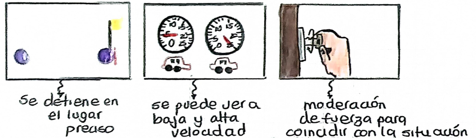

Figura 1. Variables a controlar de un Servomotor. 

## 1.2 Componentes 

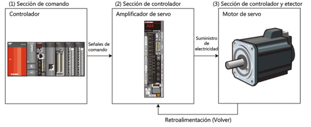

Figura 2. Componentes del control de un servomotor. 

* El servomotor permite control mecánico ON - OFF

# 2. Motores
## 2.1 Tipos de motores
### 2.1.1 Motor DC

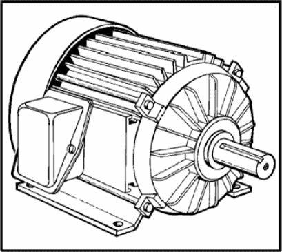

Figura 3. Motor DC. 

> 🔑Definición: Los motores DC están compuestos por un rotor (bobinado) y un estator, que genera un campo magnético mediante imanes. La interacción entre el campo magnético del estator y la corriente en el bobinado del rotor produce una fuerza electromagnética que genera el movimiento. Además, las escobillas permiten la transferencia de corriente al embobinado del rotor, asegurando una continuidad.

* Hay un consumo alto en este motor, Hay mucha potencia, pero a más potencia se necesita más tamaño del motor.
* Cuentan con un colector de delgas que Su función principal es actuar como un conmutador mecánico, permitiendo que la corriente cambie de dirección en las bobinas del rotor conforme este gira, manteniendo así un movimiento continuo. 

### 2.1.2 Motor AC
Existen dos tipos de motores de corriente alterna. Estos dos tipos son: 
#### 2.1.2.1 Motor Síncrono 

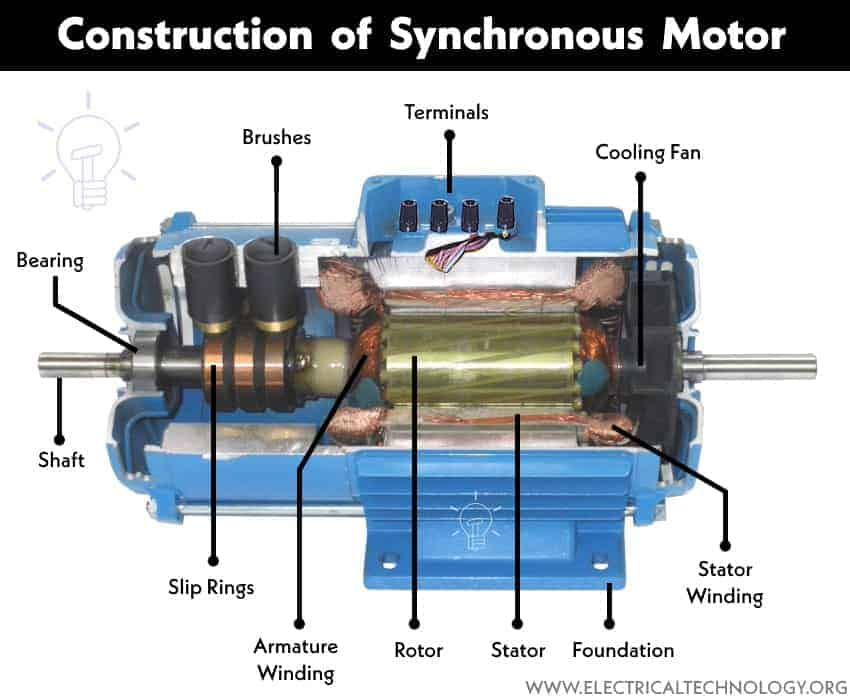

Figura 4. Motor AC síncrono. 

* Está compuesto de multiples bobinas con imanes permanentes (Niodimio). Estos imanes pueden tardar demasiado en desigmantarse, por lo que son ideales para un motor que tendrá un uso constante. 
* No hay una conexión permanente con las escobillas.
* La velocidad de rotación está vinculada con la frecuencia de la red (AC), por lo tanto hay un movimiento simultaneo.
* Es el motor más ideal de todos los tipos de motores existentes para el control de movimiento.
* Es un motor que recibe corriente trifásica, pues las bobinas están divididas en tres partes.

#### 2.1.2.2 Motor aSíncrono 

 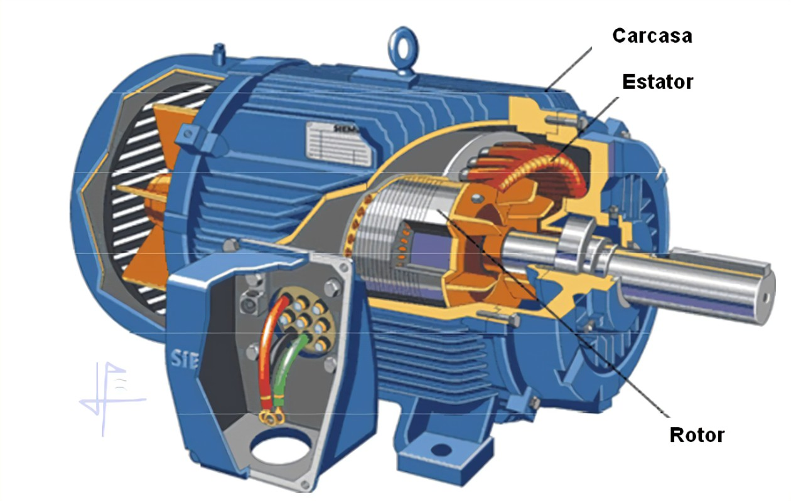

Figura 5. Motor AC asíncrono. 

> 🔑Definición del movimiento: El movimiento se produce cuando la corriente alterna en el estator genera un campo magnético giratorio. Este campo induce una corriente en el rotor, creando a su vez un campo magnético que intenta seguir al del estator. Como nunca lo puede alcanzar por la velocidad de este, se genera un efecto de arrastre.

* Tiene embobinados en el rotor y en el estator.
* El campo magnético generado por las bobinas del estator induce una corriente en el rotor.
* Torque grande = Motor más grande.
* Otros motores:
  
  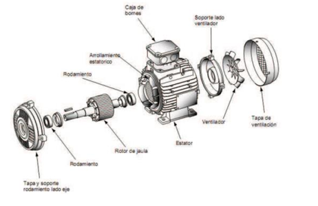

Figura 6. Motor asíncrono, jaula ardilla . 

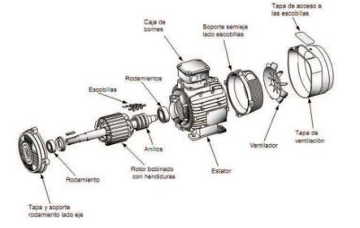

Figura 7. Motor asíncrono Rotor Bobinado. 

##### 2.1.2.2.1 Tipos de motores asincronos 
| TIPO DE MOTOR  | VENTAJAS | DESVENTAJAS  |
| ------ | ------ | ------ |
| DC | Control sencillo y preciso. Driver de potencia más fácil de implementar. Funciona bien a bajas velocidades. Eficiencia alta en aplicaciones de pequeña escala.  | Requiere mantenimiento por el desgaste de escobillas. No apto para entornos sucios / abrasivos. No adecuado para aplicaciones de alto Torque. Los imanes pueden desmagnetizarse con el tiempo.| 
| AC SÍNCRONO |  Bajo mantenimiento, ya que no tiene escobillas. Mayor eficiencia en un rango amplio de aplicaciones. Compacto y ligero en comparación con otras opciones. Resistencia alta a condiciones ambientales adversas. | Control más complejo que el de un motor DC. Se necesita sincronización precisa entre el driver y el motor. Sus imanes pueden perder magnetismo con el tiempo (Aunque duren más). | 
  
Tabla 1. Tabla de diferencias entre Motores DC y Motores AC síncronos.

## 2.2 Zonas de Operación

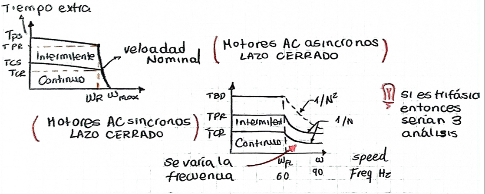

Figura 8. Zonas de operación de un motor. 

## 2.3 Validación de modelo en Simscape
* Hay que tener en cuenta que el modo de operación es continuo.
* En $$T_{máx}$$ (Vencer inercia mecánica) cuando $$v=0$$. Esto significa que con una velocidad nula, el torque va a ser nominal, como trabaja el 90% del tiempo.
* La corriente es directamente proporcional al torque.
* Hay que tener en cuenta que pueden haber momentos abruptos de más torque (No más de 10 segundos para evitar deterioramiento del motor).
* Hay que tener en cuenta que el rotor tiene carga adicional.
* 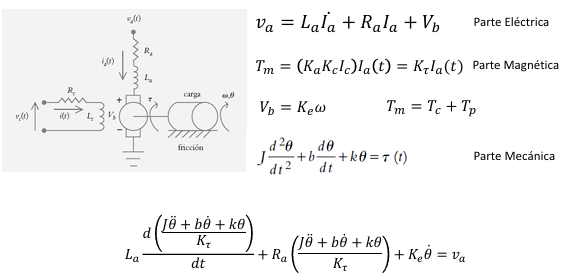

Figura 9. Modelo por corriente de armadura. 

* Se deben seguir unos pasos para poder configurar bien el sistema y analizar las zonas de operación del motor
  | PASOS  |
  | ------ |
  | 1. Solver configuration y referencias eléctrica y mecánica |
  | 2. Fuente de voltaje y de carga mecánica |
  | 3. Sensores de corriente, de velocidad angular y de torque |

  Tabla 2. Pasos para una ótima validación de modelo.
   
### 2.3.1 Validación Simscape.
La explicación del modelo se hará por medio de un ejemplo:

# 📚 Ejemplo 1:

Se escogió un motor QB02300, un motor que trabaja a 24 V.  A este motor se le sacan parámetros conocidos en el datasheet, así como también se analiza la gráfica de Torque vs Corriente y velocidad en RPM de ese motor en su zona de operación. 

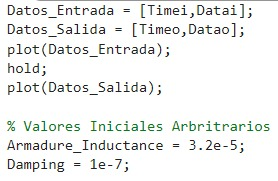

Figura 10. Parámetros iniciales.

* Se toman valores aleatorios de Inductancia de Armadura y Damping. Los valores se toman en rango con respecto a los valores por defecto del sistema. 

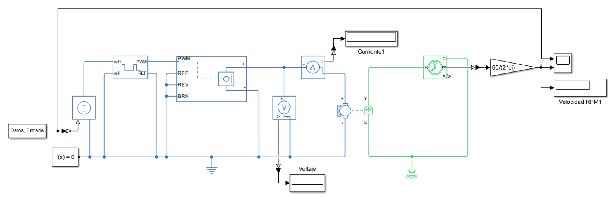

Figura 11. Gráfico en Simscape multibody. 

* Se realiza el aspecto visual del sistema, en donde se puede evidenciar generador de PWM, puente H, el motor y los aspectos electrónicos que permitirán conocer la velocidad y la corriente del motor escogido. 

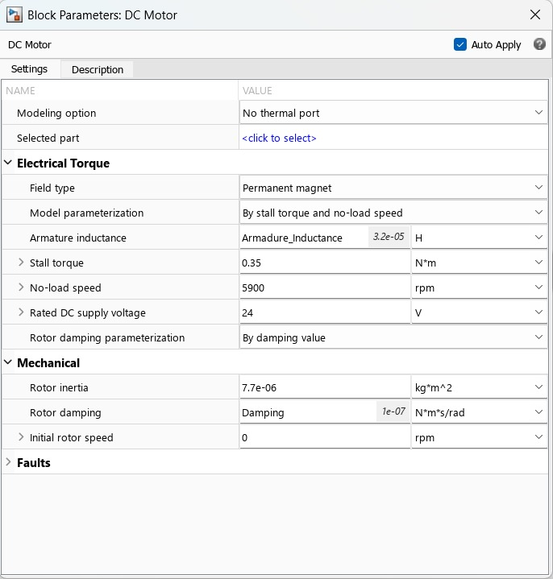

Figura 12. Parámetros del motor. 

* Se añaden parámetros conocidos del datasheet y se ubica la inductancia de armadura y damping como variables que analizará el simulink.

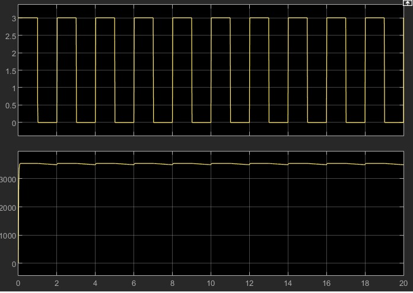

Figura 13. Torque nominal (Máx) obtenido en el sistema.

* Gráficos obtenidos para analizar el torque nominal (Máx) obtenido en el sistema

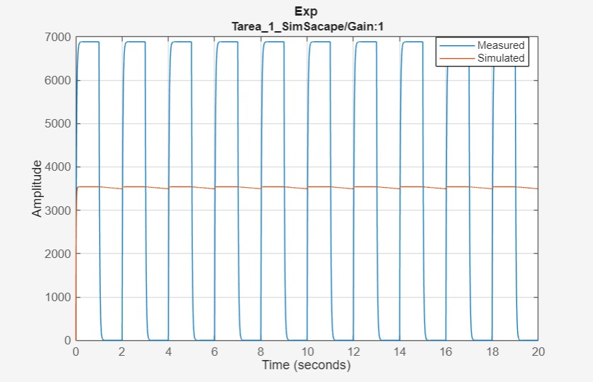

Figura 14. Gráficos del simulink. 

* Se analiza el torque máx junto vs un gráfico de los parámetros iniciales escritos en el código de simulink. 

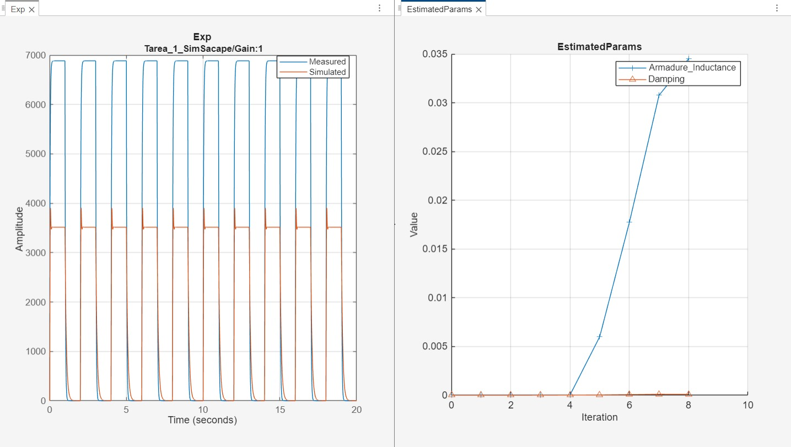

Figura 15. Obtención de Inductancia de Armadura y Damping. 

* Simulink tiene la opción de estimar parámetros. En esta estimación el sistema ubica los datos de entrada, los datos esperados y los datos tomados del datasheet; Así gráfica y aproxima los valores no conocidos para hacer más exacto el sistema y poder entender las gráficas de Torque vs Corriente y velocidad. Mientras se hace la estimación de parámetros hay que poner un tiempo de muestreo el cual es el encargado de lo que se demora el proceso. Para este ejercicio se usó un tiempo de muestreo tan bajo que la estimación fue rápida. Esto es bueno para agilizar el proceso, pero se sacrifica información que perjudica el resultado final del proceso. Si el torque nominal dado en el Datasheet era de 5690, por perdida de información se tiene un error del 40% pues el torque nominal resultante da 3511.

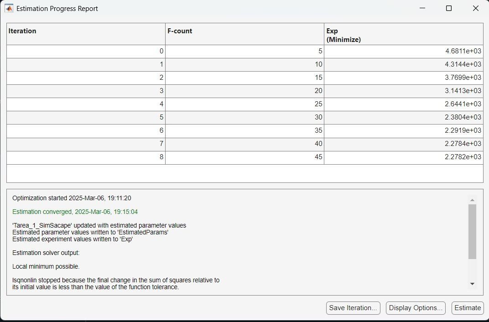

Figura 16. Proceso de estimación de parámetros. 

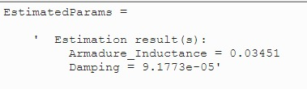

Figura 17. Resultados de la estimación. 

*Al obtener los datos aproximados arrojados por el sistema, se puede actualizar el simscape con estos valores, asegurando una mejor respuesta de gráficas. 

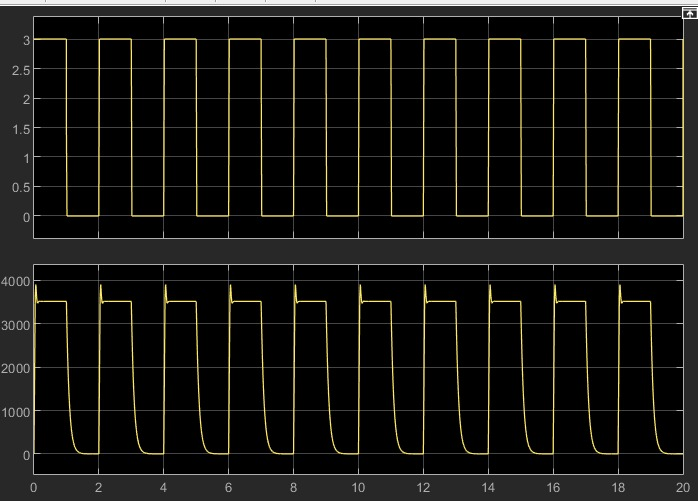

Figura 18. Obtención gráfica Torque en vacío. 

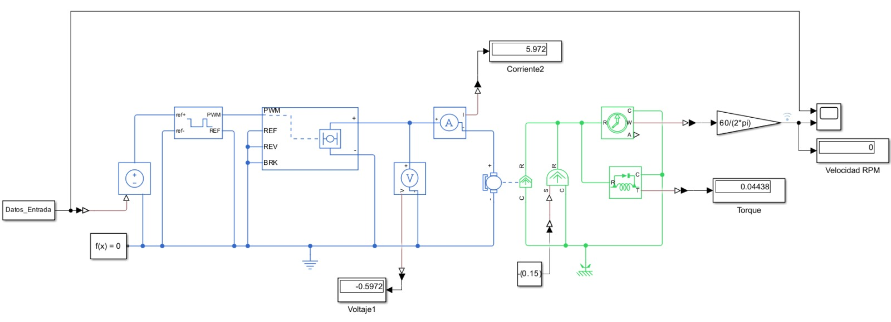

Figura 19. Sistema con carga y bloqueo. 

* Al colocar el elemento de torque ideal en referencia, se bloquea las mediciones de corriente y velocidad. Sin embargo esto solo se hace para asegurar el valor de torque del sistema. 

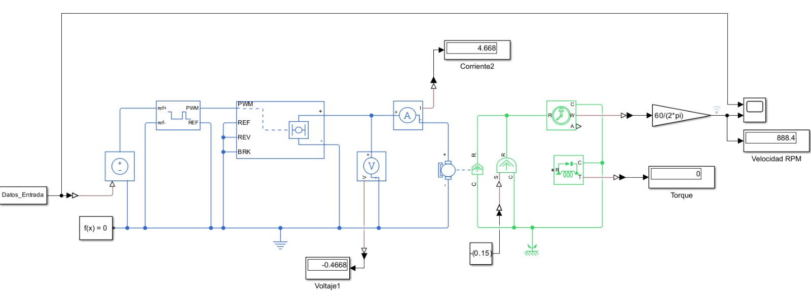

Figura 20. Sistema con carga y sin bloqueo. 

* Se retira la referencia antes mencionada y se puede analizar velocidad (RPM) y corriente del sistema. 

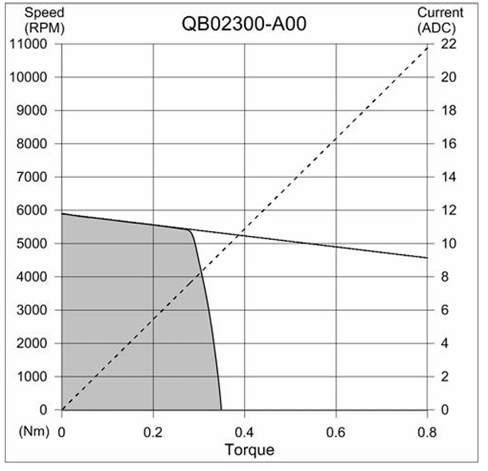

Figura 21. Gráficos de Torque vs Corriente y Voltaje (Datasheet) . 

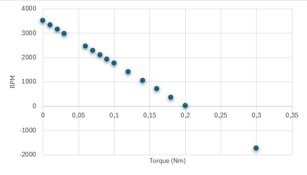

Figura 22. Gráficos de Torque vs Velocidad. 

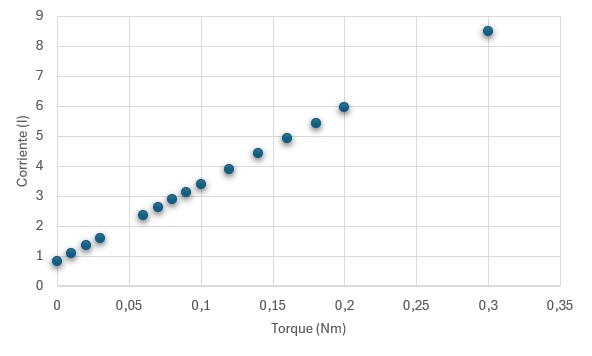

Figura 23. Gráficos de Torque vs Corriente. 

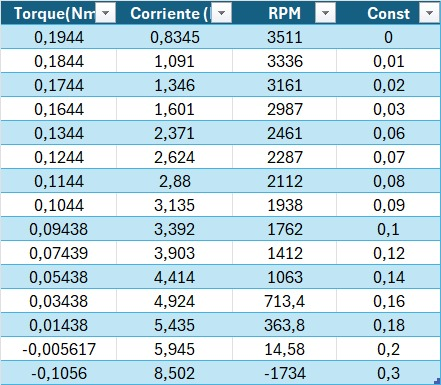

Figura 24. Tabla de datos. 

* Se analiza que es muy parecido visualmente al gráfico dado en el datasheet del motor. Sin embargo, se cuenta con un motor sin un torque apto, pues al perder información en el proceso de estimación, el torque disminuyó a tal punto que su modo de operación disminuyó a un torque de 0.2, lo que perjudica tanto la velocidad como la corriente del mismo. 

### 2.3.2 Elementos
* Los elementos en Simscape se dividen en múltiples sistemas. Es decir, elementos en color azul - Eléctricos. Color verde - Mecánicos, entre otros.

# 3. Sensores para servomecanismos 
## 3.1 Encoders
> 🔑Definición: Sensores usados para medir posición y velocidad de un motor.

Existen dos tipos de encoders:

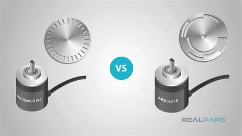

Figura 25. Encoders incrementales y absolutos.

1. Encoder Incremental: Tiene ranuras que permiten el paso de la luz y esto se ve reflejado en pulsos.
   * En cuadratura. $$90° \alpha$$
   * Operación de retorno durante encendido.
   * Precio: Bajo
  
2. Encoder Absoluto: Tiene un código digital de posición para una sola revolución.
   * Casi no se usa en la industria. Pero si se pudiera decir uno que se use mucho, sería el Gray. 
   * Precio: Alto
   * El código está perforado en el encoder.
     
## 3.2 Resolver 

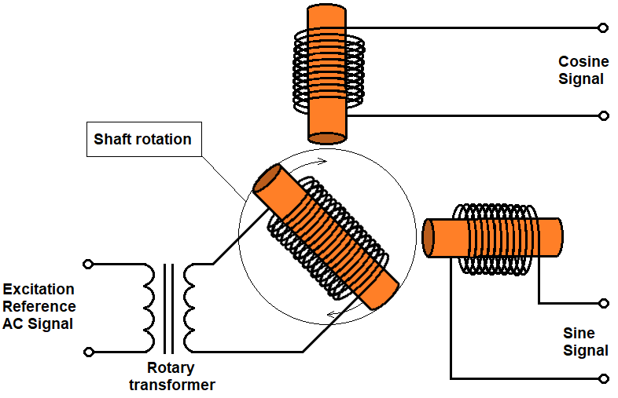

Figura 26. Sistema interno de un resolver.

> 🔑Definición: Sensor de posición angular que cuenta con un rotor y un estator.

* Se parece mucho al funcionamiento de un transformador.
* Lo hay con o sin escobillas.
* Los voltajes típicos de operación están entre 2V y 40V RMS, con una frecuencia de funcionamiento entre 50 Hz y 20 kHz.
* La relación de transformación entre el devanado primario y secundario varía entre 0.2 V/V y 1 V/V.

## 3.3 Sensores Shunt y Hall 
 > 🔑Definición: Sensores que se usan para medir torque. Como se sabe que la corriente es directamente proporcional al torque, se usan Leyes de Ohm y Faraday.

### 3.3.1 Shunt

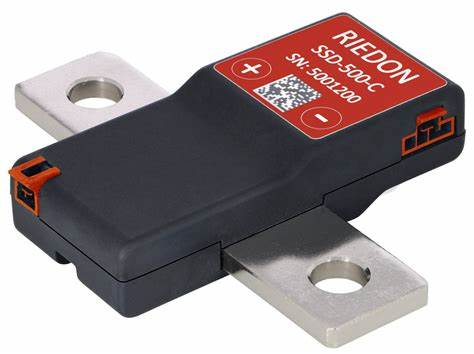

Figura 27. Shunt de Corriente.

 > 🔑Definición: Resistencia que se usa para medir la tensión. Con estos dos valores establecidos se realiza la ley de Ohm para conocer la corriente.
* Costo bajo.
* Es malo usar Shunt para corrientes grandes.
* Tiene un alto consumo de energía.
* No tiene problemas de saturación.
* Rango de medida: 6000 A.
  
### 3.3.2 Hall 

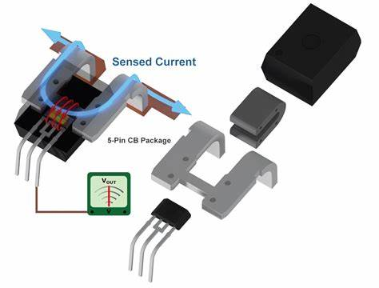

Figura 28. Sensor Hall para medicion de corriente.

 > 🔑Definición: Sensor que detecta cambios magnéticos y por medio de la ley de Faraday para obtener esa corriente. 
* Costo alto.
* Es bueno usar Hall para corrientes grandes.
* Tiene un consumo medio de energía.
* Tiene problemas de saturación.
* Rango de medida: 0 - 1000 A.

## 3.4 Drivers de Potencia
 > 🔑Definición: Un driver de potencia es un dispositivo que regula y suministra la energía necesaria a motores y actuadores, permitiendo su control eficiente. Convierte señales de baja potencia en señales de alta potencia, ajustando velocidad, dirección y torque, además de proteger el sistema contra sobrecargas.

* En el curso se usará driver de potencia por medio de PWM.

* Usar L298.
  
 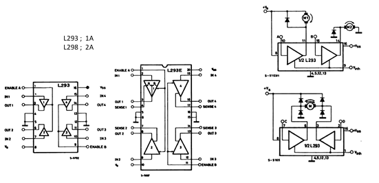

Figura 29. PWM junto con un puente H en Simscape.

* SPWM e Inversores
  
 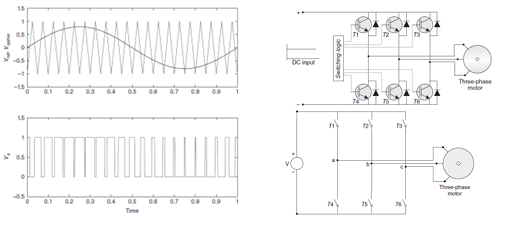

Figura 30. SPWM e inversores vistos en clase.

# Conclusiones

El control de movimiento en sistemas electromecánicos depende de una integración precisa entre motores, servomotores, sensores y drivers de potencia. Cada componente cumple un papel fundamental: los motores transforman la energía en movimiento, los servomotores permiten un control preciso, los sensores proporcionan retroalimentación esencial y los drivers de potencia regulan la energía suministrada. Una selección inadecuada o un mal diseño puede comprometer el desempeño del sistema, por lo que es crucial comprender sus principios de operación y características. La simulación y validación, como en el caso de Simscape, optimizan su implementación y garantizan un rendimiento eficiente. 
# Referencias
[1] “Login aulas 2025”, Edu.co. [En línea]. Disponible en: https://aulas.ecci.edu.co/mod/resource/view.php?id=217536. [Consultado: 06-mar-2025].

